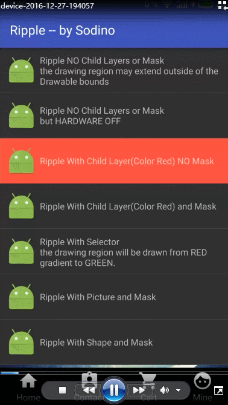

# Ripple
A Ripple effect demo


GitHub源码:[Ripple Demo](https://github.com/sodino/Ripple/)  
RippleDrawable官方文档链接:[RippleDrawable](https://developer.android.com/reference/android/graphics/drawable/RippleDrawable.html)  
效果图如下:




--------------

# Ripple效果的设置

可以在XML布局文件中对 `View` 的 `android:background` 属性进行赋值.  
`android:foreground` 的Ripple支持仅支持 `FrameLayout` 或其子类如support-v7中的 `CardView`.  
`android:foreground` 的Ripple使用场景为当点击不透明的`Image`时,见效果图中的`Ripple by 'foreground' Only FrameLayout Support`  
也可以在代码中动态设置.  


--------------
# Ripple的生效

当 `View` 有设置 `OnClickListener` 的情况下被点击, 或者获得/失去焦点变化时,将出现Ripple效果.


--------------

# 不适用Ripple的场景

* 点击之后就立马消失的组件(setVisibility:gone invisible 或 remove).      
  因为当组件恢复为`visiable`后，未播放完的`Ripple`动画会继续播放，会产生疑惑。

--------------
# 无边界的Ripple (unbounded ripple)  

见效果图中第一行`Ripple NO Child Layers or Mask` (/drawable/ripple.xml)

````  
 <!-- An unbounded red ripple. --/>
 <ripple android:color="#ffff0000" />
````  

当`ripple`标签内只指定一个`android:color`属性时，则该`ripple`效果的绘制会溢出其所在`View`的边界，直接绘制在父控件的背景之上。  
如果父控件没有设置背景，则会进一步绘制在父控件的上一级父控件的背景之上。  

如在`Demo`中`layout/layout_toolbar.xml`，把作为`rootView`的`LinearLayout`的属性`android:background="@android:color/background_dark"`删除,则会出现下图的效果:  


---------------

# 硬件加速开关对无边界Ripple的影响

在Android 3.0 (API level 11)引入的硬件加速功能默认在application/Activity/View这三个层级上都是开启的。  
但如果手贱关闭了，则无边界`Ripple`不会生效。   
见效果图中的第二行`Ripple NO Child Layers or Mask but HARDWARE OFF`

---------------

# 子层(Child Layer)

由于`View`在不同的交互下有不同的`state`,常见的为`pressed`和'focused'或`normal`这三种状态.  
所以`Ripple`通过多个`item`来表示不同`state`下的显示,每个`item`都是一个子层(Child Layer),能够直接显示`color`、`shape`、`drawable/image` 及 `selector`.  

当`Ripple`存在一个或多个子层时,则`ripple`效果则被限定在当前`View`的边界内了.无边界效果(unbounded ripple)失效.

````
// ↓↓↓ Ripple With Child Layer(Color Red) and Mask
<ripple android:color="@android:color/holo_green_light">
    <item android:id="@android:id/mask"
        android:drawable="@android:color/holo_red_light" />
</ripple >


// ↓↓↓ Ripple With Shape and Mask
<ripple android:color="@android:color/holo_green_light">
    <item android:id="@android:id/mask">
        <shape android:shape="rectangle">
            <solid android:color="@android:color/holo_red_light" />
            <corners android:radius="30dp" />
        </shape>
    </item>
</ripple >

// ↓↓↓ Ripple With Picture and Mask
<ripple android:color="@android:color/holo_green_light">
    <item android:id="@android:id/mask"
        android:drawable="@drawable/google" />
</ripple >

// ↓↓↓ Ripple With Selector
// ↓↓↓ the drawing region will be drawn from RED gradient to GREEN.
<ripple android:color="@android:color/holo_green_light">
    <item>
        <selector>
            <item android:drawable="@android:color/holo_red_light"
                    android:state_pressed="true"/>
            <item android:drawable="@android:color/transparent"/>
        </selector>
    </item>
</ripple >

````

---------------

# Mask层(Mask Layer)
可以设置指定子层`item`的`android:id="@android:id/mask"来设定当前`Ripple`的`Mask`.  
`Mask`的内容并不会被绘制到屏幕上.它的作用是限定`Ripple`效果的绘制区域.
* mask所在的的子层限制了`Ripple`效果的最大范围只能是`View`的边界,不会扩散到父组件.
* 控制`ripple`效果区域的细节显示.  
  细节显示可以通过`Ripple With Picture and Mask`来理解.本处中用于显示的是一张背景透明的彩色`Google`图片,但`Ripple`的扩散过程中只在有颜色的区域中慢慢扩散,透明区域则仍是透明.

  


  

---------------

# 与ClickableSpan冲突  

如果`Layout`有包含`ClickableSpan`的`TextView`,则发现该`Layout`设置`Ripple`的效果无法响应.        
这个现象可以推断出`MotionEvent`这个事件在`TextView`这一层级被消耗完了.下一步应该为找出该事件为什么被消耗?     
通过debug源码,发现当点击事件传递到`TextView`时,会进一步传递给`LinkMovementMethod::onTouchEvent()`,如果点击位置处于`ClickableSpan`以外,则返回`Touch.onTouchEvent(widget, buffer, event);`
该方法在处理`MotionEvent::ACTION_DOWN`时默认返回`true`,导致`Ripple`失效.见下图(android(level 23) source code ):     
  

那么解决思路也就简单了,重写`LinkedMovementMethod::onTouchEvent()`方法,当且仅当点击到`ClickableSpan`时,才返回`true`即可.  
核心代码如下:  
````

                int action = event.getAction();

                if (action == MotionEvent.ACTION_UP ||
                        action == MotionEvent.ACTION_DOWN) {
                    int x = (int) event.getX();
                    int y = (int) event.getY();

                    x -= getTotalPaddingLeft();
                    y -= getTotalPaddingTop();

                    x += getScrollX();
                    y += getScrollY();

                    Layout layout = getLayout();
                    int line = layout.getLineForVertical(y);
                    int off = layout.getOffsetForHorizontal(line, x);

                    // get ClickableSpan whick were pressed
                    ClickableSpan[] link = buffer.getSpans(off, off, ClickableSpan.class);
                    
                    if (link.length != 0) {
                        // if find ClickableSpan
                        if (action == MotionEvent.ACTION_UP) {
                            link[0].onClick(this);
                        } else if (action == MotionEvent.ACTION_DOWN) {
                            Selection.setSelection(buffer,
                                    buffer.getSpanStart(link[0]),
                                    buffer.getSpanEnd(link[0]));
                        }
                        // consume DOWN or other action
                        return true;
                    } else {
                        // if none
                        Selection.removeSelection(buffer);
                    }
                    // deliver to parent view
                    return false;
````

当然,在Demo中,为了进一步简化,直接把`LinkedMovementMethod::onTouchEvent()`写到了`RippleTextView::onTouchEvent()`中去.具体见[源码](https://github.com/sodino/Ripple/blob/master/app/src/main/java/com/sodino/ripple/RippleTextView.java).

